# Project Atiria 🦋
### Longitudinal Analysis of Systemic Lupus Erythematosus (SLE)

**Project Atiria** is a personal Data Science and Machine Learning initiative designed to monitor and analyze the evolution of Systemic Lupus Erythematosus (SLE) through clinical data. By applying statistical analysis and machine learning techniques to longitudinal exam results and medication history, the project aims to uncover patterns, correlations, and predictive insights regarding the disease's progression.

---

## 📖 About the Project

Lupus is a complex autoimmune disease with a highly variable presentation. This project moves beyond standard tracking by attempting to build a custom dataset from a patient's history to perform descriptive and predictive analysis.

**Key Objectives:**
* **Data Centralization:** Extracting and organizing data from non-digital sources (PDF clinical exams, physical records) and medication logs.
* **Longitudinal Analysis:** Tracking the progression of specific biomarkers over time.
* **Pattern Recognition:** Using Machine Learning to identify correlations between medication dosage, bloodwork results, and symptom flare-ups.

---

## 🦋 The Story Behind the Name

The name **Atiria** is a reference to the Brazilian literary classic *"O caso da borboleta Atíria"* (The Case of the Butterfly Atiria) by Lúcia Machado de Almeida. This name was chosen for several symbolic reasons:

1.  **The Detective:** In the book, Atiria is a butterfly acting as a detective, mirroring the investigative nature of this data science project.
2.  **The Species:** The character is based on the *Atyria isis*, an Amazonian moth species.
3.  **Overcoming Limitations:** In the story, Atiria has a wing defect that prevents her from flying high or fast. Her success as an investigator shows that physical limitations do not define capability—a powerful metaphor for living with a chronic condition.
4.  **The Symbol:** The butterfly is the universal symbol of Lupus, representing the "malar rash" (butterfly rash) that often appears across the cheeks and nose of patients.

---

## ⚙️ Technical Approach & Methodology

The project follows a structured data science pipeline, moving from unstructured medical records to actionable insights.

```mermaid
graph TD
    A[📂 Private PDF Sources] -->|Extraction| B(⚙️ ETL & Privacy Scrubbing)
    B --> C{📊 Anonymized Data}
    C -->|Unsupervised ML| D[🧠 Pattern Detection]
    D --> E[📈 Batch Inference]
    
    style A fill:#ff9999,stroke:#333
    style B fill:#ffd1dc,stroke:#333
    style C fill:#bbf,stroke:#333
```

### Data Structure & Strategy

* **Source:** The primary input consists of unstructured data (PDF clinical reports) converted into **unlabeled, structured tabular data**. 
* **Machine Learning:** Given the nature of a single-patient longitudinal dataset, the project utilizes **Unsupervised Learning** (e.g., Clustering and Anomaly Detection). 
* **Justification:** Unsupervised algorithms are ideal for detecting hidden structures and health "states" without requiring pre-defined labels. This allows the model to identify anomalies that may correspond to potential flare-ups.
* **Inference:** The system uses **Batch Inferencing**, processing data in cycles as new exam results are added.

---

## 🔒 Data Privacy & Ethics

Given that this project involves sensitive medical information (Protected Health Information), privacy is a core architectural pillar.

* **Data Decoupling:** Personal identifying information (name, address, patient ID) is stripped during the ETL phase. The repository contains only code and anonymized data.
* **Storage Security:** All raw clinical documents and medication logs are stored in encrypted, private cloud storage and are never committed to the public GitHub repository.
* **`.gitignore` Implementation:** A strict configuration is used to prevent the accidental upload of `.csv`, `.pdf`, or `.json` files containing clinical data.
* **Local Processing:** All data transformations are performed in private environments, ensuring that sensitive health metrics remain under the owner's control.

---

## 🛠️ Tech Stack

* **Language:** Python
* **Data Manipulation:** Pandas, NumPy
* **Machine Learning:** Scikit-learn
* **Visualization:** Seaborn, Matplotlib
* **Workflow:** ETL (Extract, Transform, Load), Statistical Analysis

---

## 📍 Roadmap & Status

**Current Phase: ETL & Data Engineering**
The project is currently focused on the rigorous extraction of data from PDF files. This involves cleaning, parsing, and normalizing clinical values to create a robust dataset for analysis.

- [x] Project Conception & Architecture
- [ ] **ETL Pipeline Development (In Progress)**
- [ ] Exploratory Data Analysis (EDA)
- [ ] Unsupervised Model Training
- [ ] Visualization Dashboard
